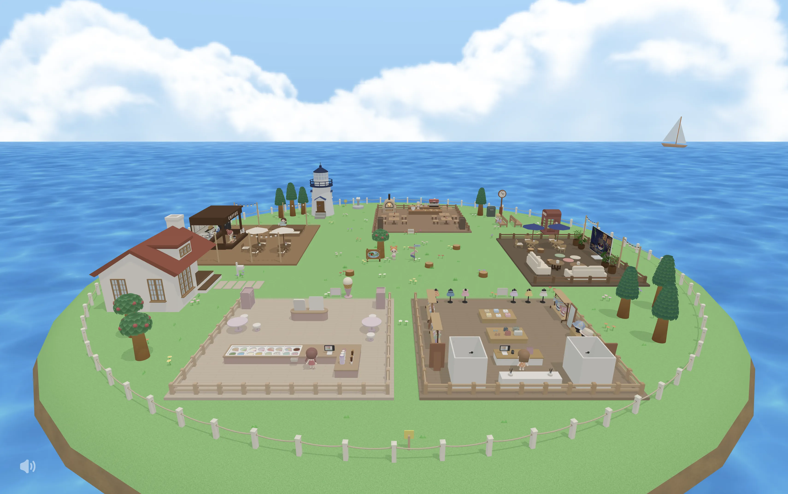
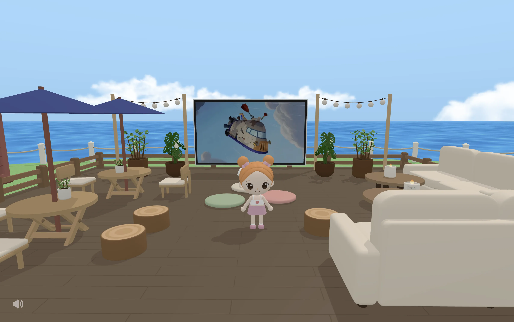
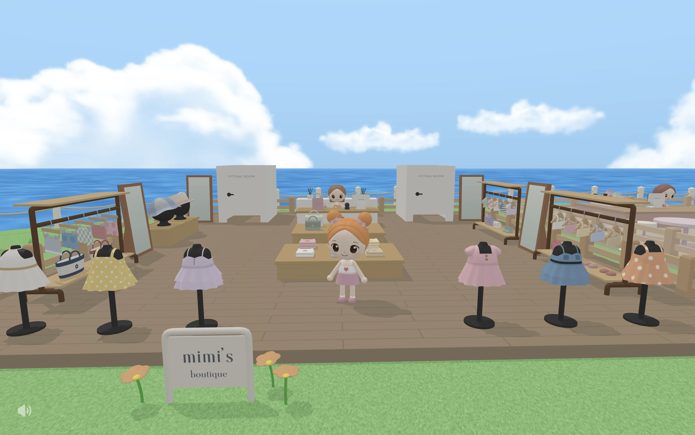
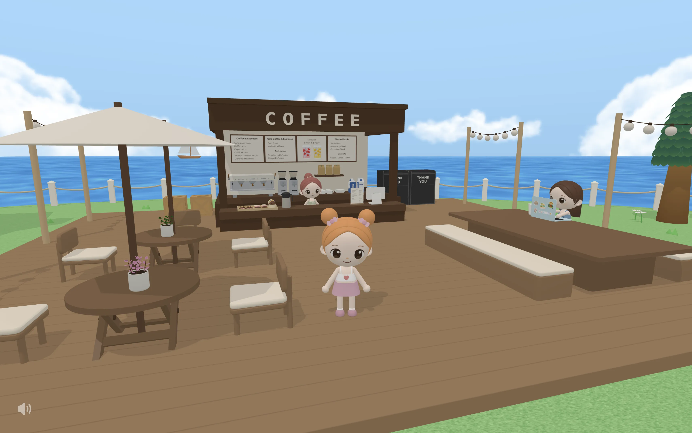
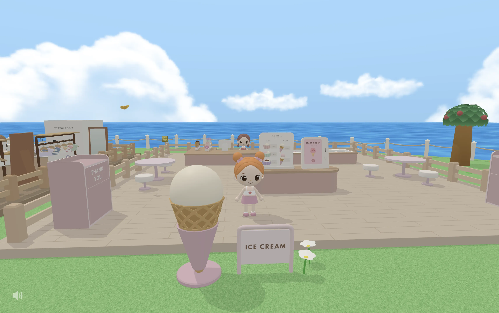
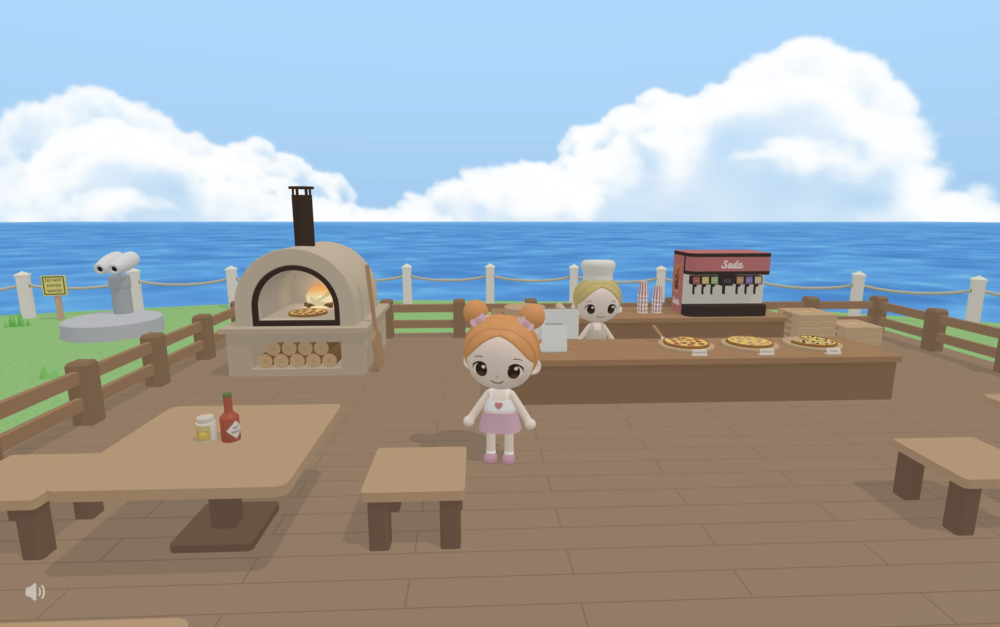
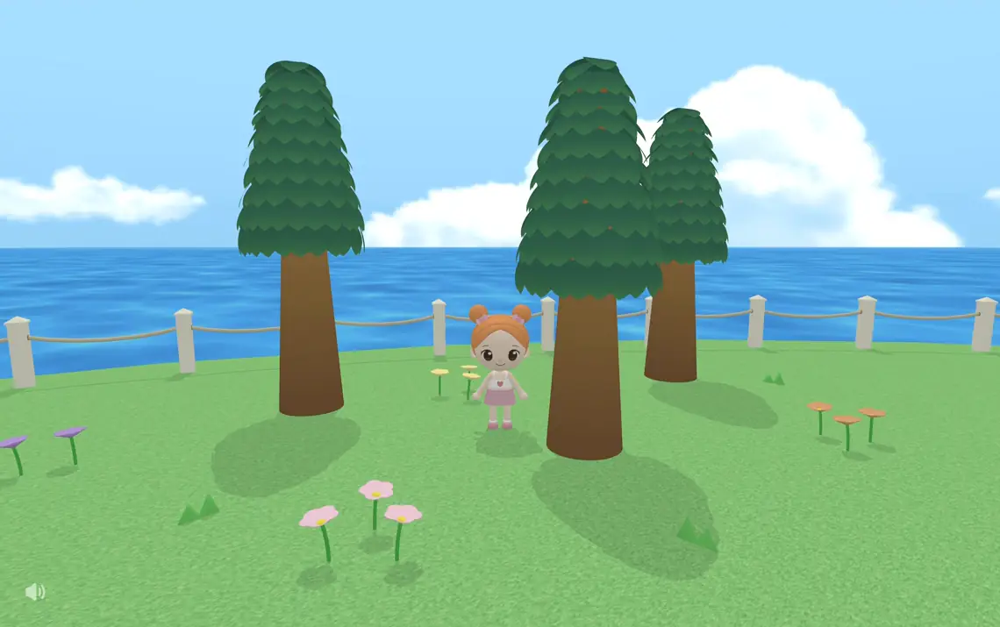

# 🍎 Appleland

Appleland is a 3D browser game built with Three.js. It's a cute, cozy world with lots of things to interact with. I coded the game and modeled all the 3D assets from scratch.

If you'd rather explore Appleland without any spoilers, you might want to play the game before reading further!

## Tech Stack

**Built with:** JavaScript • Three.js • GLSL • HTML • CSS • Blender • Vite

## Table of Contents

- [Explore Appleland](#explore-appleland)
  - [Lounge](#lounge)
  - [Boutique](#boutique)
  - [Cafe](#cafe)
  - [Ice Cream Shop](#ice-cream-shop)
  - [Pizzeria](#pizzeria)
- [Technical Highlights](#technical-highlights)
  - [Geometry Merging](#geometry-merging)
  - [Custom Game Systems](#custom-game-systems)
  - [Spatial Partitioning](#spatial-partitioning)
  - [Instanced Rendering & Custom Shaders](#instanced-rendering--custom-shaders)

## Explore Appleland

### Lounge

In the lounge, you can sit wherever you prefer, watch TV, and bring some food over to enjoy. I hope you find this place relaxing!

### Boutique

In the boutique, you can change your outfit! While building the game, I visited the boutique often to change my look whenever I wanted to freshen things up. I asked some of my friends about their favorite outfits, and it was really fun to see how different everyone's tastes were. If you ever visit the boutique, let me know your favorite outfit :)

### Cafe

At the cafe, you can order drinks and desserts to enjoy at a table. You'll also find trash bins around Appleland, which you can use whenever you need to empty your hands.

### Ice Cream Shop

In the ice cream shop, you can order at the counter or use the kiosk. You can choose a cup or cone, pick your number of scoops, and choose from 16 different ice cream flavors.

### Pizzeria

In the pizzeria, you can order pizza by the slice and soda!

## Technical Highlights

### Geometry Merging

During game initialization, I merged the geometries of the meshes based on hierarchy and material compatibility while preserving their world positions.

I organized model instances in the world into semantic groups (e.g., cafe, boutique), with each group represented through parent-child relationships. Each group had one root, with the rest connected to it hierarchically. Then I traversed each group from the root and categorized the meshes based on material compatibility: those using vertex colors, image textures, or image textures with transparent backgrounds, which I called print. Then I merged the geometries of all the meshes that shared the same material type within the same group, while making sure that those meshes actually shared the same material, so they could be rendered in a single draw call.

For meshes using image textures, I achieved this by using a texture atlas. I combined the images into a single image and adjusted the UV maps of each mesh accordingly while creating the 3D models in Blender.

While merging the geometries, I excluded meshes that change state during gameplay (e.g., clock hands, doors, and light bulbs).

By grouping the meshes this way, I could drastically lower the draw call count while still taking advantage of frustum culling. While building the game, my target was to keep the draw call count under 100, and I managed to achieve a total of 85 when everything is in the camera's view. During normal gameplay, the draw call count is usually much lower. The total can also change when you order food.

### Custom Game Systems

I implemented custom collision, interaction, and camera collision systems.

Along with the 3D models, I added meshes in Blender to represent colliders, interaction triggers, and camera blockers, categorized into two bound types: circle and AABB. For simplicity, the circle type includes both 2D circular bounds and 3D cylindrical bounds.

When processing the loaded models, I extracted their local-space bounds based on the bound type. I used these bounds as reusable templates, then transformed them into world space for each model instance added to the scene.

#### Collision System

When checking collisions, I took the player's radius into account and based it on the size of the feet rather than the larger head.

For objects that don't intersect with the player's head, I kept the colliders closely fitted to the objects without extra padding. This makes collisions feel more accurate when the player's feet touch an object or fall from its edge.

For tall objects that intersect with the player's head but cannot be stepped onto, I added padding to the colliders to prevent the player's head from clipping through them.

For tall objects that can also be stepped onto, I had to consider both preventing head clipping and keeping falls from edges feeling natural. For tall objects with an overhead section, I used a one-way collider sized based on the player's head along with the main collider fitted to the object. The one-way collider was detected only from below, preventing the player's head from clipping through the overhead section of the object when jumping underneath it without affecting falls from the edge.

For other tall objects, I chose the collider setup based on how the player was likely to interact with them. If the player would mostly walk into the object rather than step onto it, I sized the collider based on the player's head for simplicity. If the player was also likely to step onto it, I kept the main collider fitted to the object and added a very thin collider extending outward near its base. This helped prevent head clipping when walking into the object while remaining unnoticeable if the player ended up on it by jumping or falling.

I also added a separate boundary check to prevent the player from going outside the fence surrounding the world.

Most colliders are static, but some are added or removed dynamically for interactable objects such as doors and ordered food items.

#### Interaction System

Interaction triggers are regions on the XZ plane. When the player enters one of these regions, the corresponding interaction prompt appears and the player can interact with the object by pressing the E key.

When triggers overlap, they are registered in priority order so the first matching trigger is used.

Each interactable can have multiple interaction triggers. For example, the fitting room has triggers both outside and inside, allowing the same door to be opened or closed from either side.

#### Camera Collision System

Players are not supposed to see inside certain structures, such as the house or lighthouse. I enclosed these structures within camera blockers and cast a ray from the player toward the camera on the XZ plane.

When the ray intersects a blocker, I calculate the distances from the ray origin to its entry and exit points. If the desired camera distance falls between the entry and exit distances, I snap it to the entry distance to keep the player visible. However, if the player is inside the blocker and the entry point lies behind the ray origin, I snap the camera distance to the exit distance instead.

Using the same entry and exit distances, I also check the actual camera distance during smoothing. This prevents the camera from passing through a blocker when the current and desired camera positions are on opposite sides of the blocker and the desired position is outside the blocker.

### Spatial Partitioning

I divided the world into grid cells, which I called sections. After transforming the bounds of colliders, interaction triggers, and camera blockers into world space, I registered them with the sections they overlapped. The trigger bounds were part of the interactable data, so I registered the corresponding interactable data with each section rather than the trigger bounds alone. For camera blockers, I also registered blocker bounds from the neighboring 3×3 area with each section, since the player and camera could be in adjacent sections.

This way, during the game loop, I could check only the data associated with the player's current section instead of the entire world.

### Instanced Rendering & Custom Shaders

I used instanced rendering for fence segments, flowers, grass, and trees.

#### Fence

For the fence surrounding the world, I created a single fence segment and used instanced rendering to repeat it around the perimeter. The whole fence could be rendered in a single draw call using per-instance transforms with the segment's geometry and material.

#### Flowers & Grass

For flowers, I combined instanced rendering with custom shaders.

I stored a transform for each instance to determine its position and rotation, while sharing a single geometry and material across them.

To create a sway effect, I wrote custom vertex shader logic that rotates each vertex sideways in the local XY plane around the flower's origin at its base. The sway strength increases with the vertex's height, so the top of the flower moves more than the base. I passed a random value for each instance to the shader to offset its sway phase, so the instances don't all sway in sync.

When creating the flower models in Blender, I used vertex colors, assigning white to the petals and the intended colors to the other parts. In the fragment shader, I used those vertex colors as a mask to recolor the petals with the per-instance color passed to the shader.

I applied the same vertex deformation logic to the shadows, so the shadows move in sync with the swaying flowers.

This way, I could render all instances of the same flower type in a single draw call while still having per-instance variation in sway and color.

For grass, I used the same approach as flowers, except without the color variation.

#### Trees

For trees, I used instanced rendering separately for leaves and trunks so I could use a custom vertex shader on the leaves to create a sway effect.

When creating each tree model in Blender, I created a leaf template used to render all leaf instances of that tree type. I also created separate meshes that defined the position and rotation of each leaf on the tree, which I collectively called the leaf layout.

During game initialization, I extracted the transforms from the leaf layout and reused them across all tree instances of the same type, converting them into world space using each tree instance's transform. Using these per-instance transforms with the leaf template's geometry and material, all leaf instances of the same tree type could be rendered in a single draw call.

To make the leaves sway, I wrote custom vertex shader logic that rotates the vertices of each leaf instance sideways in its local XY plane around its pivot at the top. I passed a random value for each leaf instance to the shader so the leaves don't all sway in sync.

For height variation without stretching the leaves, I scaled only the trunk instances and moved the leaves vertically according to each trunk instance's Y scale. Using per-instance transforms with the shared geometry and material, all trunk instances of the same tree type could be rendered in a single draw call.

This way, all instances of each tree type could be rendered using two draw calls, one for the leaves and one for the trunks.

## Let's Connect

If you find this project interesting and want to talk about it in more depth, please feel free to reach out! I'm always happy to walk through any of the technical details behind the game.

Thanks for reading! :)
